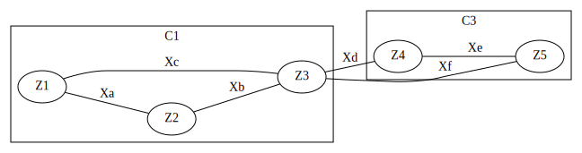
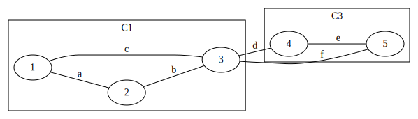
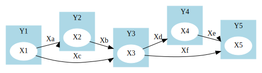
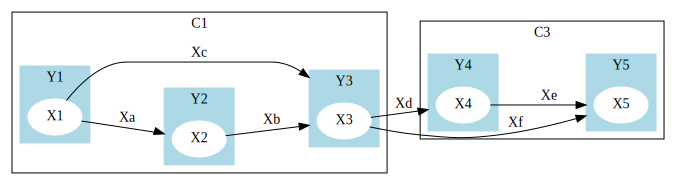
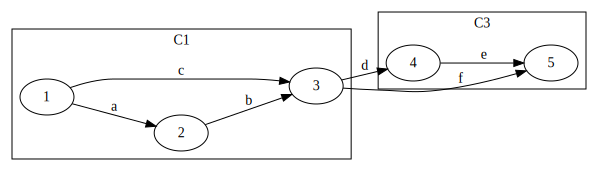

---
jupytext:
  formats: ipynb,md:myst
  text_representation:
    extension: .md
    format_name: myst
    format_version: 0.13
    jupytext_version: 1.13.8
kernelspec:
  display_name: Python 3 (ipykernel)
  language: python
  name: python3
---

# Density

+++

```{important}
How to generalize the density formula beyond graphs?
```

+++

Recall that, for a simple graph on $V$ with edge set $\mc{E}\subseteq {V\choose 2}$,
the density function is

$$
\begin{align}
\rho(B) &= \frac{\overbrace{\abs{{B\choose 2}\cap \mc{E}}}^{\mu(B)=}}{|B|} && \text{for }B\subseteq V:\abs{B}\geq 1,
\end{align}
$$

which is the number of edges internal to $B$ per node in $B$.

+++

```{important}
What about
- weighted hypergraphs?
- weighted directed hypergraphs?
- undirected/directed info-nets?
```

+++ {"tags": []}

## Undirected info-nets

+++

Consider the info-net

$$\R{Z}_V:=(\R{Z}_i|i\in V) \sim P_{\R{Z}_V}\in \mc{P}(Z_V),$$ (info-net)

where $\R{Z}_i$ is a discrete random variable representing node $i\in V$.

The density can be

$$
\begin{align}
\rho(B) &= \frac{\overbrace{H(\R{Z}_B|\R{Z}_{V\setminus B})}^{\mu(B)=}}{|B|} && \text{for }B\subseteq V:\abs{B}\geq 1,
\end{align}
$$ (rho:source)

which measures the amount of information per node internal to $B$ not available from $V\setminus B$.

+++

---

**Example**  
:label: eg:info-net:touching-triangles-C1-C3



With $C_1:=\Set{1,2,3}$ in the info-net defined in {prf:ref}`eg:info-net:touching-triangles`,

$$
\begin{alignat}{2}
H(\R{Z}_{C_1}|\R{Z}_{V\setminus C_1}) &= H(\R{X}_{\text{a}},\R{X}_{\text{b}},\R{X}_{\text{c}})&&=3~\text{bits}\\
\rho(C_1)
&= \frac{H(\R{Z}_{C_1}|\R{Z}_{V\setminus C_1})}{\abs{C_1}} &&= 1~\text{bit per node.}
\end{alignat}
$$

With $C_3:=\Set{4,5}$,

$$
\begin{alignat}{3}
H(\R{Z}_{C_3}|\R{Z}_{V\setminus C_3}) &= H(\R{X}_{\text{e}})&&=1~\text{bit}\\
\rho(C_3)
&= \frac{H(\R{Z}_{C_3}|\R{Z}_{V\setminus C_3})}{\abs{C_1}} &&= \frac{1}{2}~\text{bit per node}&&<\rho(C_1)
\end{alignat}
$$

---

+++

The density may be normalized to

$$
\rho(B) = \frac{H(\R{Z}_B|\R{Z}_{V\setminus B})}{\underbrace{H(\R{Z}_B)}_{\nu(B)=}},
$$ (rho:source:normalized)

which measures the amount of information internal to $B$ over the amount of information available from $B$. If the denominator is non-zero, we have $\rho(B)\in [0,1]$ and

$$
1-\rho(B) = \frac{\overbrace{I(\R{Z}_B\wedge \R{Z}_{V\setminus B})}^{\delta(B)=}}{H(\R{Z}_B)},
$$

where the numerator measures the mutual information available from $B$ and from $V\setminus B$.

+++

---

**Example**

With $C_1=\Set{1,2,3}$ as in {prf:ref}`eg:info-net:touching-triangles-C1-C3`,

$$
\begin{alignat}{2}
H(\R{Z}_{C_1}|\R{Z}_{V\setminus C_1}) &= H(\R{X}_{\text{a}},\R{X}_{\text{b}},\R{X}_{\text{c}}) && =\underline{3~\text{bits}}\\
H(\R{Z}_{C_1}) &= H(\R{X}_{\text{a}},\R{X}_{\text{b}},\R{X}_{\text{c}},\R{X}_{\text{d}},\R{X}_{\text{f}})&&=\underline{5~\text{bits}}\\
I(\R{Z}_{C_1}\wedge \R{Z}_{V\setminus C_1}) &= H(\R{X}_{\text{d}},\R{X}_{\text{f}}) && =\underline{2~\text{bits}}\\
\rho(C_1)
&= \frac{H(\R{Z}_{C_1}|\R{Z}_{V\setminus C_1})}{H(\R{Z}_{C_1})} &&= \underline{\frac{3}{5}}\\
1-\rho(C_1) &= \frac{I(\R{Z}_{C_1}\wedge \R{Z}_{V\setminus C_1})}{H(\R{Z}_{C_1})} &&= \underline{\frac{2}{5}}.
\end{alignat}
$$

With $C_3:=\Set{4,5}$,

$$
\begin{alignat}{3}
H(\R{Z}_{C_3}|\R{Z}_{V\setminus C_3}) &= H(\R{X}_{\text{e}})&&=\underline{1~\text{bits}}\\
H(\R{Z}_{C_3}) &= H(\R{X}_{\text{d}},\R{X}_{\text{e}},\R{X}_{\text{f}})&&=\underline{3~\text{bits}}\\
I(\R{Z}_{C_3}\wedge \R{Z}_{V\setminus C_3}) &= H(\R{X}_{\text{d}},\R{X}_{\text{f}}) && =\underline{2~\text{bits}}\\
\rho(C_3)
&= \frac{H(\R{Z}_{C_3}|\R{Z}_{V\setminus C_3})}{H(\R{Z}_{C_3})} &&= \underline{\frac{1}{3}}&&< \rho(C_1)\\
1-\rho(C_3) &= \frac{I(\R{Z}_{C_3}\wedge \R{Z}_{V\setminus C_3})}{H(\R{Z}_{C_3})}&&=\underline{\frac23}.
\end{alignat}
$$

---

+++

The minimum normalized cut for spectral clustering may be generalized using the normalized density as

$$
\begin{align}
\min_{\substack{B\subsetneq V:\\ \abs{B}\geq 1}} \left[ \frac{\delta(B)}{\nu(B)} + \frac{\delta(V\setminus B)}{\nu(V\setminus B)}\right]
&= \min_{\substack{B\subsetneq V:\\ \abs{B}\geq 1}} \left[\frac{I(\R{Z}_B\wedge \R{Z}_{V\setminus B})}{H(\R{Z}_B)} + \frac{I(\R{Z}_B\wedge \R{Z}_{V\setminus B})}{H(\R{Z}_{V\setminus B})}\right]\\
&= \min_{\substack{B\subseteq V\\ \abs{B}\geq 1}} \left[1 - \rho(B) + 1- \rho(V\setminus B)\right],
\end{align}
$$

which is well-defined under the mild condition

$$\underbrace{H(\R{Z}_i)}_{\nu(\Set{i})=}>0\qquad \forall i\in V.$$

+++

```{note}
The condition $H(\R{Z}_i)>0$ for all $i\in V$ can be enforced simply by removing all trivial nodes $i$ from $V$ with no information, i.e., $H(\R{Z}_i)=0$.
```

+++ {"tags": []}

### Weighted hypergraphs

+++

Consider hypergraphical sources where, for $i \in V$,

$$\R{Z}_i:=(\R{X}_e|i\in \phi(e))$$ (hypergraphical)

where 
- $\phi(e)\subseteq V$ denotes the set of incident nodes for a hyperedge $e\in E$, and
- $(X_e|e\in E)$ consists of mutually independent edge random variables with $H(X_e)=w_e\geq 0$, which can be regarded as the weight of the hyperedge $e\in E$ incident on the nodes in $\phi(e)\subseteq V$.

+++

The density reduces to

$$
\rho(B) = \frac{\overbrace{\sum_{e\in E: \phi(e)\subseteq B} w_e}^{\mu(B)=}}{|B|},
$$ (rho:weighted-hypergraph)

where $\mu(B)$ is the total weight of edges internal to $B$.

+++

For $B$ with incident edges of non-zero weights, the density may be normalized to

$$
\rho(B) = \frac{\sum_{e\in E: \phi(e)\subseteq B} w_e}{\underbrace{\sum_{e\in E:\phi(e)\cap B\neq \emptyset} w_e}_{\nu(B)=}},
$$ (rho:weighted-hypergraph:normalized)

where $\nu(B)$ is the total weight of edges incident on $B$. 

It follows that $\rho(B)\in [0,1]$ and

$$
1-\rho(B) = \frac{\overbrace{\sum_{e\in E: \phi(e)\nsubseteq B, B\nsubseteq \phi(e)} w_e}^{\delta(B)=}}{\sum_{e\in E:\phi(e)\cap B\neq \emptyset} w_e}
$$

where $\delta(B)$ is the total weight of edges crossing $B$.

+++

---

**Example**  
:label: eg:weighted-hypergraph



To reduce the info-net in {prf:ref}`eg:info-net:touching-triangles` to a weighted hypergraph, let $E:=\Set{\text{a},\dots,\text{g}}$ and

$$
\begin{align}
    w_{\text{a}} &:=1 & \phi(\text{a})&:=\Set{1,2}\\
    w_{\text{b}} &:=1 & \phi(\text{b})&:=\Set{2,3}\\
    w_{\text{c}} &:=1 & \phi(\text{c})&:=\Set{1,3}\\
    w_{\text{d}} &:=1 & \phi(\text{d})&:=\Set{3,4}\\
    w_{\text{e}} &:=1 & \phi(\text{e})&:=\Set{4,5}\\
    w_{\text{f}} &:=1 & \phi(\text{f})&:=\Set{3,5}.
\end{align}
$$

With $C_1=\Set{1,2,3}$, 

$$
\begin{align}
\sum_{e\in E: \phi(e)\subseteq C_1} w_e &= \sum_{e\in \Set{\text{a},\text{b},\text{c}}} 1 && = \underline{3}\\
\sum_{e\in E: \phi(e)\cap C_1\neq \emptyset} w_e &= \sum_{e\in \Set{\text{a},\text{b},\text{c},\text{d},\text{f}}} 1 && = \underline{5}\\
\rho(C_1) &= \frac{\sum_{e\in E: \phi(e)\subseteq C_1} w_e}{\sum_{e\in E:\phi(e)\cap C_1\neq \emptyset} w_e} &&= \underline{\frac35}.
\end{align}
$$

With $C_3=\Set{4,5}$, 

$$
\begin{align}
\sum_{e\in E: \phi(e)\subseteq C_3} w_e &= \sum_{e\in \Set{\text{e}}} 1 && = \underline{1}\\
\sum_{e\in E: \phi(e)\cap C_3\neq \emptyset} w_e &= \sum_{e\in \Set{\text{d},\text{e},\text{f}}} 1 && = \underline{3}\\
\rho(C_1) &= \frac{\sum_{e\in E: \phi(e)\subseteq C_3} w_e}{\sum_{e\in E:\phi(e)\cap C_3\neq \emptyset} w_e} &&= \underline{\frac13}.
\end{align}
$$

---

+++ {"tags": []}

### Continuous random variables

+++

If $\R{Z}_i$'s may have continuous components, one may use the discretized source $\bar{\R{Z}}_V$ satisfying

$$H(\bar{\R{Z}}_B) \approx H(\R{Z}_B) + \sum_{i\in B} m_i \qquad \forall B\subseteq V$$ (discretized-source)

for some $m_i$ proportional to the quantization rate of $\bar{\R{Z}}_i$ for $i\in V$. Then, the density is

$$
\rho(B) = \frac{\overbrace{H(\R{Z}_B|\R{Z}_{V\setminus B})+\sum_{i\in B} m_i}^{\mu(B)=}}{\abs{B}},
$$ (rho:quantized-source)

and the normalized version is

$$
\rho(B) = \frac{H(\R{Z}_B|\R{Z}_{V\setminus B})+\sum_{i\in B} m_i}{\underbrace{H(\R{Z}_B) + \sum_{i\in B} m_i}_{\nu(B)=}}.
$$ (rho:quantized-source:normalized)

It follows that $\rho(B)\in [0,1]$ and

$$
1 - \rho(B) = \frac{\overbrace{I(\R{Z}_B\wedge \R{Z}_{V\setminus B})}^{\delta(B)=}}{H(\R{Z}_B) + \sum_{i\in B} m_i}.
$$

+++ {"tags": []}

## Directed networks

+++

To extend the formula for weighted digraphs, consider 

$$
\begin{align}
\R{X}_V &:=(\R{X}_i|i\in V) && \text{(inputs)}\\
\R{Y}_V &:=(\R{Y}_i|i\in V) = t(\R{X}_V) && \text{(outputs)},
\end{align}
$$

where $t$ is a deterministic channel that 
- takes a discrete random quantity $\R{X}_i$ as input from every $i\in V$, with $H(\R{X}_i)>0$,
- generates $\R{Y}_V$ as a deterministic function of $\R{X}_V$, i.e., 

  $$H(\R{Y}_V|\R{X}_V)=0,$$
  
- and returns $\R{Y}_i$ as an output to $i\in V$.

+++

---

**Example** (Directed info-net on touching triangles)  
:label: eg:directed-info-net:touching-triangles



We can turn the info-net in {prf:ref}`eg:info-net:touching-triangles` into a directed info-net by defining the inputs $\R{X}_V$ and outputs $\R{Y}_V$ as

$$
\begin{align}
\R{X}_1 &:= (\R{X}_{\text{a}}, \R{X}_{\text{c}}) & \R{Y}_1 &:=0\\
\R{X}_2 &:= \R{X}_{\text{b}} & \R{Y}_2 &:=\R{X}_{\text{a}}\\
\R{X}_3 &:= (\R{X}_{\text{d}},\R{X}_{\text{f}}) & \R{Y}_3 &:= (\R{X}_{\text{b}},\R{X}_{\text{c}})\\
\R{X}_4 &:= \R{X}_{\text{e}} & \R{Y}_4 &:= \R{X}_{\text{d}}\\
\R{X}_5 &:=0 & \R{Y}_5 &:= (\R{X}_{\text{e}},\R{X}_{\text{f}}).
\end{align}
$$

For instance, $\R{X}_a$ and $\R{X}_c$ are
- generated by node $1$ and
- observed respectively by nodes $2$ and $3$.

In a citation network, $\R{X}_a$ and $\R{X}_c$ may represent original results in articles written by scholar $1$ and cited by scholars $2$ and $3$.

---

+++

The normalized density can be defined as

$$
\rho(B) := \frac{\overbrace{H(\R{X}_B|\R{X}_{V\setminus B},\R{Y}_{V\setminus B})}^{\mu(B):=}}{\underbrace{H(\R{X}_B)}_{\nu(B):=}},
$$ (rho:deterministic-channel:normalized)

which measures the fractional amount of information in the input from $B$ not available outside $B$. Note that this reduces to {eq}`rho:source:normalized` when the outputs are trivial, i.e., $H(\R{Y}_V)=0$.

It follows that $\rho(B)\in [0,1]$ and

$$
1-\rho(B) = \frac{\overbrace{I(\R{X}_B\wedge \R{Y}_{V\setminus B}|\R{X}_{V\setminus B})}^{\delta(B):=}}{H(\R{X}_B)}.
$$

+++

---

**Example** (Directed info-net on touching triangles)  
:label: eg:directed-info-net:touching-triangles-C1-C3

 


The normalized densities for $C_1$ and $C_3$ can be computed for the directed info-net in {prf:ref}`eg:directed-info-net:touching-triangles` as follows. 

With $C_1=\Set{1,2,3}$,

$$
\begin{alignat}{2}
H(\R{X}_{C_1}|\R{X}_{V\setminus C_1},\R{Y}_{V\setminus C_1}) &= H(\R{X}_{\text{a}},\R{X}_{\text{b}},\R{X}_{\text{c}}) && =\underline{3~\text{bits}}\\
H(\R{X}_{C_1}) &= H(\R{X}_{\text{a}},\R{X}_{\text{b}},\R{X}_{\text{c}},\R{X}_{\text{d}},\R{X}_{\text{f}})&&=\underline{5~\text{bits}}\\
I(\R{X}_{C_1}\wedge \R{Y}_{V\setminus C_1}|\R{X}_{V\setminus C_1}) &= H(\R{X}_{\text{d}},\R{X}_{\text{f}}) && =\underline{2~\text{bits}}\\
\rho(C_1)
&= \frac{H(\R{X}_{C_1}|\R{X}_{V\setminus C_1},\R{Y}_{V\setminus C_1})}{H(\R{X}_{C_1})} &&= \underline{\frac{3}{5}}\\
1-\rho(C_1) &= \frac{I(\R{X}_{C_1}\wedge \R{Y}_{V\setminus C_1}|\R{X}_{V\setminus C_1})}{H(\R{X}_{C_1})} &&= \underline{\frac{2}{5}}.
\end{alignat}
$$

With $C_3:=\Set{4,5}$,

$$
\begin{alignat}{3}
H(\R{X}_{C_3}|\R{X}_{V\setminus C_3},\R{Y}_{V\setminus C_3}) &= H(\R{X}_{\text{e}})&&=\underline{1~\text{bits}}\\
H(\R{X}_{C_3}) &= H(\R{X}_{\text{e}})&&=1~\text{bits}\\
I(\R{X}_{C_3}\wedge \R{Y}_{V\setminus C_3}|\R{X}_{V\setminus C_3})& && =\underline{0~\text{bits}}\\
\rho(C_3)
&= \frac{H(\R{X}_{C_3}|\R{X}_{V\setminus C_3},\R{Y}_{V\setminus C_3})}{H(\R{X}_{C_3})} &&= \underline{1}&&> \rho(C_1)\\
1-\rho(C_3) &= \frac{I(\R{X}_{C_3}\wedge \R{Y}_{V\setminus C_3}|\R{X}_{V\setminus C_3})}{H(\R{X}_{C_3})}&&=\underline{0}.
\end{alignat}
$$

For a citation network, $C_3$ can correspond to a community for a specific domain since all the articles, namely $\R{X}_e$, generated in $C_3$ is not cited by articles outside $C_3$. Similarly, $C_2:=\Set{3,4,5}$ has a density of $1$.

---

+++ {"tags": []}

### Weighted directed hypergraphs

+++

Consider a directed hypergraphical source where, for $i\in V$,

$$
\begin{align}
\R{X}_i&:=(\R{X}_e|e\in E, i=\theta(e))\\
\R{Y}_i&:=(\R{X}_e|e\in E, i\in \phi(e))
\end{align}
$$ (directed-hypergraphical)

where
- $\theta(e)\in \phi(e)$ denotes the root node of a hyperedge $e\in E$,
- $\phi(e)\subseteq V$ denotes the set of incident nodes for a hyperedge $e\in E$, and
- $(X_e|e\in E)$ consists of mutually independent edge random variables with $H(X_e)=w_e$.

+++

The normalized density becomes

$$
\rho(B) = \frac{\sum_{e\in E: \phi(e)\subseteq B} w_e}{\sum_{e\in E:\theta(e)\in B} w_e},
$$ (rho:directed-hypergraph:normalized)

which further reduces to {eq}`rho:deterministic-channel:normalized` when $\abs{\phi(B)}=2$ and $w_{ij}=\sum_{e\in E: \theta(e)=i,\phi(e)=\Set{i,j}} w_e$.

+++

---

**Example**  
:label: eg:weighted-directed-hypergraph



To reduce the directed info-net in {prf:ref}`eg:directed-info-net:touching-triangles` to a directed hypergraph, let $E:=\Set{\text{a},\dots,\text{g}}$ and

$$
\begin{align}
    w_{\text{a}} &:=1 & \phi(\text{a})&:=\Set{1,2} & \theta(\text{a})&=1\\
    w_{\text{b}} &:=1 & \phi(\text{b})&:=\Set{2,3} & \theta(\text{b})&=2\\
    w_{\text{c}} &:=1 & \phi(\text{c})&:=\Set{1,3} & \theta(\text{c})&=1\\
    w_{\text{d}} &:=1 & \phi(\text{d})&:=\Set{3,4} & \theta(\text{d})&=3\\
    w_{\text{e}} &:=1 & \phi(\text{e})&:=\Set{4,5} & \theta(\text{e})&=4\\
    w_{\text{f}} &:=1 & \phi(\text{f})&:=\Set{3,5} & \theta(\text{f})&=3.
\end{align}
$$

With $C_1=\Set{1,2,3}$, 

$$
\begin{align}
\sum_{e\in E: \phi(e)\subseteq C_1} w_e &= \sum_{e\in \Set{\text{a},\text{b},\text{c}}} 1 && = \underline{3}\\
\sum_{e\in E:\theta(e)\in C_1} w_e &= \sum_{e\in \Set{\text{a},\text{b},\text{c},\text{d},\text{f}}} 1 && = \underline{5}\\
\rho(C_1) &= \frac{\sum_{e\in E: \phi(e)\subseteq C_1} w_e}{\sum_{e\in E:\theta(e)\in C_1} w_e} &&= \underline{\frac35}.
\end{align}
$$

With $C_3=\Set{4,5}$, 

$$
\begin{align}
\sum_{e\in E: \phi(e)\subseteq C_3} w_e &= \sum_{e\in \Set{\text{e}}} 1 && = \underline{1}\\
\sum_{e\in E:\theta(e)\in C_3} w_e &= \sum_{e\in \Set{\text{e}}} 1 && = \underline{1}\\
\rho(C_3) &= \frac{\sum_{e\in E: \phi(e)\subseteq C_3} w_e}{\sum_{e\in E:\theta(e)\in C_3} w_e} &&= \underline{1}.
\end{align}
$$

---

+++ {"tags": []}

## Generalization with super/sub-modular functions

+++

```{important}
Is there a unifying formula of density? 
```

+++

The answer is affirmative by modeling the dependency using a *submodular/supermodular* function {cite}`fujishige05submodular,schrijver2002combinatorial`.

+++ {"tags": []}

### Dependency model

+++

A set function $f:2^V\to \mathbb{R}$ is said to be 
- normalized if    
    
    $$f(\emptyset)=0$$ (normalized)
- non-decreasing if

    $$f(B')\leq f(B) \qquad \forall B'\subseteq B\subseteq V$$ (non-decreasing)

- submodular if
    $$
    f(B_1)+f(B_2) \geq f(B_1\cap B_2) + f(B_1\cup B_2) \qquad \forall B_1, B_2\subseteq V.
    $$ (submodular)

+++

---

**Example**

The followings are normalized non-decreasing submodular functions:
- $\nu(B):=H(\R{Z}_B)$, the entropy function for discrete random variables.
- $\nu(B):=\abs{B}$, the cardinality function. 

---

+++

Alternatively, the conditions may also be stated concisely as

$$f(\emptyset)=0\leq f(B|B')\leq f(B|B'') \qquad \forall B''\subseteq B'\subseteq B\subseteq V$$ (normalized-monotonic-submodular)

using the conditional $f$ defined as

$$f(B_1|B_2):=f(B_1\cup B_2)- f(B_2) \qquad \forall B_1,B_2\subseteq V.$$ (conditional)

+++

A set function $f$ is supermodular if {eq}`submodular` holds with the reverse inequality $\leq $ instead.  
Combined with normalized and non-decreasing properties, the condition can be stated concisely as

$$f(\emptyset)=0\leq f(B|B')\leq f(B|B'') \qquad \forall B'\subseteq B''\subseteq B\subseteq V$$ (normalized-monotonic-supermodular)

+++

---

**Example**

The followings are normalized non-decreasing supermodular functions:

- $-\nu(B):=-H(\R{Z}_B)$, the negated entropy function for discrete random variables.
- $\mu(B):= H(\R{Z}_B\mid \R{Z}_{V \setminus B})$, the conditional entropy function for discrete random variables.
- $\nu(B):=\abs{B}$, the cardinality function.

---

+++

A function is said to be *modular* if it is both submodular and supermodular. The cardinality function is an example.

+++ {"tags": []}

### Density

+++

---

**Definition** (Density)  
:label: def:density

The *density function* is defined as

$$
\begin{align}
\rho(B) &:= \frac{\mu(B)}{\nu(B)} && \text{for} B\subseteq V: \abs{B}\geq 1
\end{align}
$$ (rho)

for any $(V,\mu,\nu)$ network where
- $V$ is a set of $n\geq 1$ vertices;
- $\mu:2^V\to \mathbb{R}$ is the mass function that is normalized, non-decreasing, and supermodular {eq}`normalized-monotonic-submodular`; and
- $\nu:2^V\to \mathbb{R}$ is the volume function that is normalized, non-decreasing, and submodular {eq}`normalized-monotonic-supermodular`.

To avoid singularity, we further impose

$$
\nu(\Set{i})>0 \qquad \forall i\in V.
$$ (non-singular)

---

+++

As $\nu$ is non-decreasing, {eq}`non-singular` ensures that density $\rho(B)$ is well-defined, namely, $\nu(B)>0$, for all non-empty subsets $B$. Extension to singular subsets without imposing {eq}`non-singular` is trivial:

+++

---

**Remark**

For a $(V,\mu,\nu)$ network that does not satisfy {eq}`non-singular`, there is a unique maximum 0-volume subset

$$B_0:= \Set{i|i \in V, \nu({i})=0}$$

so that the network $(V',\mu',\nu')$ defined below by contracting $B_0$ satisfies {eq}`non-singular`:

$$
\begin{align}
V'&:=V\setminus B_0\\
\mu'(B)&:=\mu(B|B_0)\\
\nu'(B)&:=\nu(B|B_0)=\nu(B\setminus B_0)
\end{align}
$$

for all $B\subseteq V'$. 

It suffices to study the contracted network $(V',\mu',\nu')$ because

- if $\mu(B_0)=0$, then  
  
  $$\rho(B)=\rho(B\setminus B_0)\qquad \forall B\subseteq V:\abs{B}\geq 1,$$
  
- and if $\mu(B_0)>0$, then
  
  $$B\supseteq B_0 \qquad \forall B\in \mc{D}_k, k> \abs{B_0}.$$
  
  For the remaining cases where $k\leq \abs{B_0}$, $\mc{D}_k$ in {eq}`densest-k` is ill-posed.

---

+++

In particular, to reduce to {eq}`rho:deterministic-channel:normalized`, define

- $\nu(B):=H(\R{X}_B)$, which is the entropy function for discrete random variables, and 
- $\mu(B):=H(\R{X}_B|\R{X}_{V\setminus B}, \R{Y}_{V\setminus B}) = H(\R{X}_B, \R{Y}_B|\R{X}_{V\setminus B}, \R{Y}_{V\setminus B})$ ($\because H(\R{Y}_V|\R{X}_V)=0$), which is the conditional entropy function.

```{code-cell} ipython3

```
