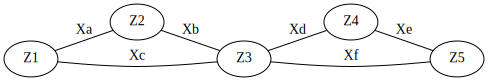

---
jupytext:
  formats: ipynb,md:myst
  text_representation:
    extension: .md
    format_name: myst
    format_version: 0.13
    jupytext_version: 1.13.8
kernelspec:
  display_name: Python 3 (ipykernel)
  language: python
  name: python3
---

+++ {"tags": []}

# The Problem beyond Densest Subgraphs

```{code-cell} ipython3
:tags: [remove-cell]

from visualization import dumbbell
```

```{important}
How to find meaningful informationally dense subsets?
```

+++

Consider an *information network (info-net)* defined by a discrete random tuple

$$\R{Z}_V:=(\R{Z}_i|i\in V),$$ 

where
- $V$ is a finite set of nodes and
- $\R{Z}_i$ is the information/representation of node $i\in V$.

+++

---

**Example** (info-net on touching triangles)  
:label: eg:info-net:touching-triangles



Given $6$ uniformly random independent bits 

$$\R{X}_j \text{ for } j\in \Set{\text{a},\dots,\text{f}},$$ 

define $\R{Z}_V$ for the $5$ nodes in $V:=\Set{1,\dots, 5}$ as

$$
\begin{align}
\R{Z}_1 &:= (\R{X}_{\text{a}},\R{X}_{\text{c}})\\
\R{Z}_2 &:= (\R{X}_{\text{a}},\R{X}_{\text{b}})\\
\R{Z}_3 &:= (\R{X}_{\text{b}},\R{X}_{\text{c}},\R{X}_{\text{d}},\R{X}_{\text{f}})\\
\R{Z}_4 &:= (\R{X}_{\text{d}},\R{X}_{\text{e}})\\
\R{Z}_5 &:= (\R{X}_{\text{e}},\R{X}_{\text{f}}).
\end{align}
$$

$C_1:=\Set{1,2,3}$ and $C_2:=\Set{3,4,5}$ are informationally dense intuitively as they corresponds to $3$-cliques if we view each bit $\R{X}_j$ as an edge.

---

+++

```{important}

1. How to define information density?
2. How to define informationally dense subsets?
3. How to characterize/compute informationally dense subsets in polynomial time?

For consistency, the answers should reduce to those for graphical networks.
```

+++ {"tags": []}

## Density for graphs

+++

For a simple graph on $V$ with edges

$$\mc{E}\subseteq {V\choose 2}:=\Set{B\subseteq V |\abs{B}=2},$$ 

the density function is defined as

$$
\rho(B) := \frac{\abs{{B\choose 2}\cap \mc{E}}}{|B|},\qquad \text{for }B\subseteq V:\abs{B}>0,
$$ (rho:graph)

where the numerator is the number of the edges internal to $B$ per node in $B$.

+++

```{important}
How to define dense subgraphs?
```

+++ {"tags": []}

## Densest subgraphs

+++

Define

$$
\mc{D}_* := \arg \overbrace{\max_{\substack{B\subseteq V:\\ \abs{B}\geq 1}}\rho(B)}^{\rho_*:=},
$$ (densest)

which 

- corresponds to the set of vertex sets of the densest subgraphs and
- can be computed in polynomial time by solving a parametric maxflow problem {cite}`goldberg1984finding,gallo1989fast`.

+++

PS: not parametric maxflow?

+++

---

**Example** (Dumbbell)  
:label: eg:dumbbell

For integer $b\geq 3$, construct a graph on $V=C_1\cup C_2$ as a disjoint union of a $b$-clique on $C_1$ and another one on $C_2$ connected by an edge. 

---

```{code-cell} ipython3
:tags: [hide-input]

dumbbell()
```

$C_1,C_2\not\in \mc{D}_*$ even though they are meaningful dense subsets:

$$
\begin{align}
\rho(C_1) &= \rho(C_2) \\
&= \frac{{b \choose 2}}{b} = \frac{b-1}{2}\\
\rho(V)&=\frac{2{b \choose 2} + 1}{2b} \\
&= \rho(C_1) + \frac1{2b} > \rho(C_1). 
\end{align}
$$

+++

```{important}
How to identify $C_1$ and $C_2$ as clusters?
```

+++ {"tags": []}

## Densest $k$-subgraphs

+++

Denote the collection of densest $k$-subsets for order $k\geq 1$ as

$$
\begin{align}
\mc{D}_k &:= \arg \overbrace{\max_{\substack{B\subseteq V:\\ \abs{B}=k}}\rho(B)}^{\rho_k:=}. 
\end{align}
$$ (densest-k)

+++

In Example {prf:ref}`eg:dumbbell`, $C_1, C_2\in \mc{D}_b$.

+++

- Unfortunately, computing the densest $k$-subgraphs is NP-hard as it reduces to the maximal clique problem in polynomial time {cite}`garey1979computers,feige1997densest`.
- Fortunately, not all densest $k$-subsets are meaningful. For instance, in Example {prf:ref}`eg:dumbbell`, all subsets in $\mc{D}_{k}$ for $k>b$ must split either $C_1$ or $C_2$.

+++

```{important}
- How to identify only meaningful dense subsets?
- Do they have to be densest $k$-subgraphs for some $k$?
```

+++ {"tags": []}

## Beyond densest $k$-subgraphs

+++

---

**Example** (Broken dumbbell)  
:label: eg:broken-dumbbell

For integer $b \geq 4$, construct a graph on $V=C_1\cup C_2$ by connecting a $b$-clique on $C_1$ and a quasi $b$-clique on $C_2$ with an edge removed. 

---

```{code-cell} ipython3
:tags: [hide-input]

dumbbell(b=4, t="broken")
```

$C_2\not\in \mc{D}_b$ even though it is a meaningful subset:

$$
\begin{align}
\rho(C_1) &= \frac{b-1}{2}\\
\rho(C_2) &= \frac{b-1}{2} - \frac1{2b} <  \rho(C_1).
\end{align}
$$

+++

```{important}
Our goal is 
- to develop a **combinatorial information theory** by
- defining meaningful clusters of dense subsets **beyond graphs and applicable to info-net**, and
- **characterizing/computing the clusters** in polynomial time.
```

```{code-cell} ipython3

```
